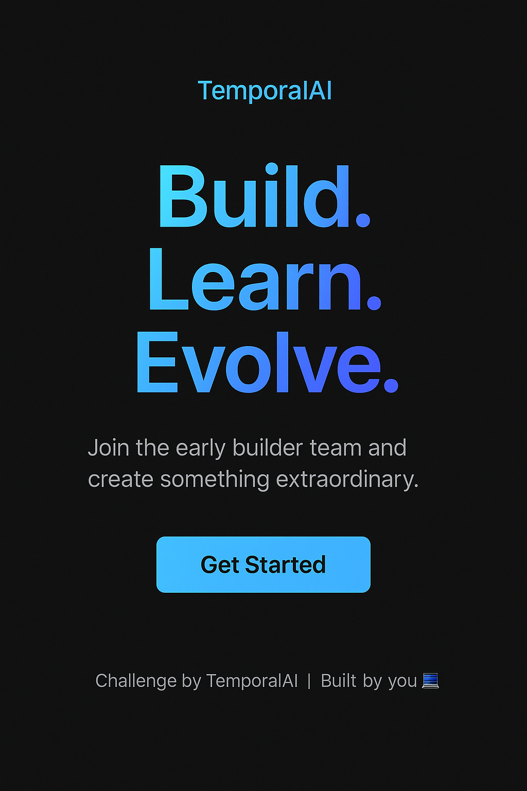

  

<h1 align="center">💧 TemporalAI Frontend Challenge — Hero Section</h1>

  <strong>Build. Learn. Evolve.</strong> 
  Your first mission as an early builder: rebuild a Hero Section using only HTML + CSS.

---

## 🎯 Objective
- Recreate a clean, centered layout  
- Include a heading, paragraph, and call-to-action button  
- Make it responsive (mobile → desktop)  
- Focus on spacing, alignment, and simplicity  

---

## 🧩 Steps
1. Fork this repo or clone it locally  
2. Build your section inside `index.html`  
3. Push your work and share your repo link with your mentor for review  
4. Receive feedback and your next challenge after review  

---

## 🧠 Tip
Keep your CSS clean and well-commented.  
It’s not about complexity — it’s about **clarity and structure**.  

---

## 🚀 Next Stage
Once you complete this, we’ll move you to a **React + Tailwind** challenge.  
Welcome to the early builder circle 💧
